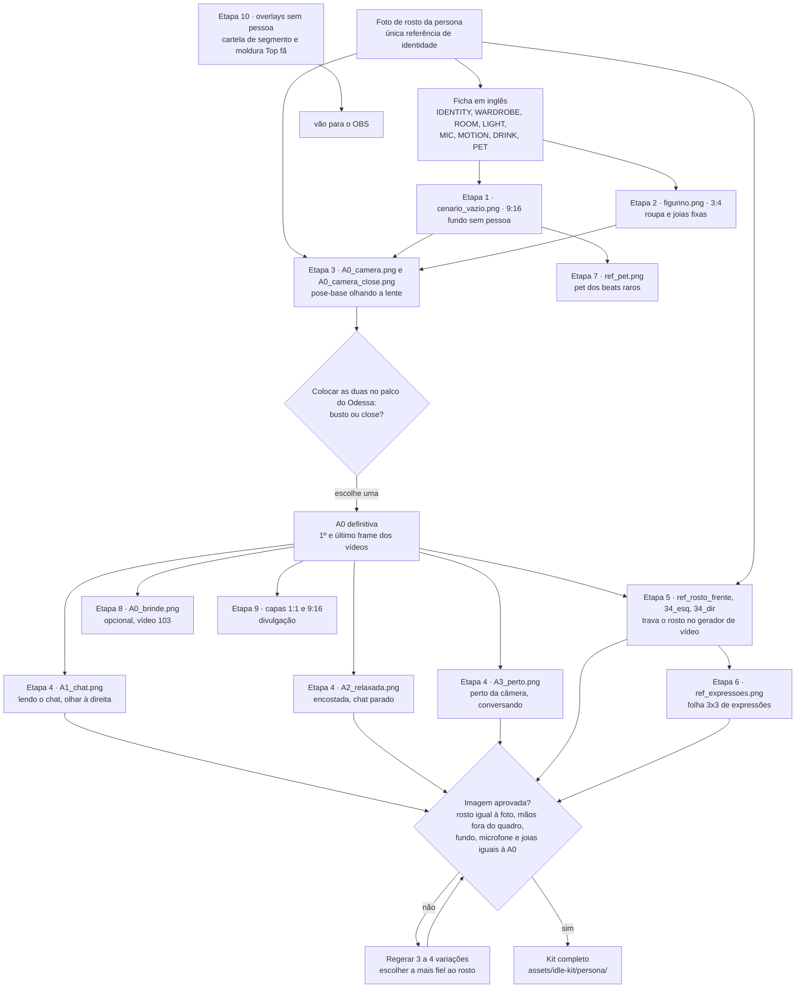
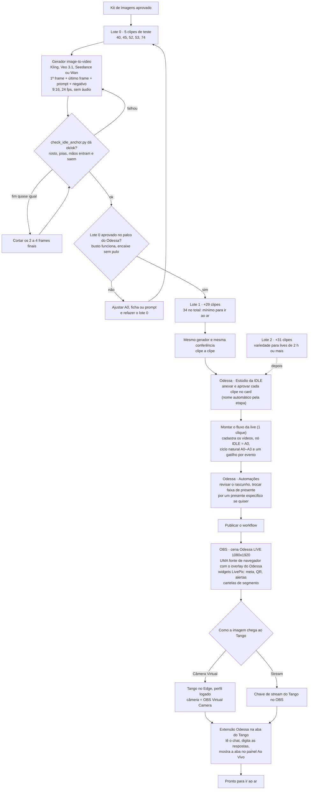
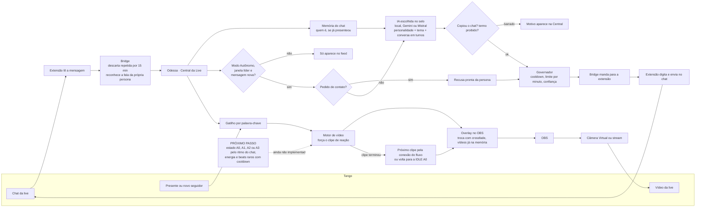

# Fluxograma da produção — da foto de rosto à live no Tango

Mesmo conteúdo da página interativa (com todos os prompts e botão de copiar).
Prompts por persona: [viktoria/PROMPTS.md](viktoria/PROMPTS.md) · [barbara/PROMPTS.md](barbara/PROMPTS.md)
(gerados por `scripts/build_idle_prompts.py`).

## A · Imagens da persona (kit da IDLE)

## B · Vídeos, Odessa e OBS (preparar a live)

## C · A live rodando

> O motor por estados (A1 quando o chat agita, A2 quando esfria, A3 enquanto a IA responde) está
> desenhado em IDLE-PRODUCAO.md, mas ainda não foi implementado: hoje o vídeo segue as conexões do fluxo e os gatilhos.
